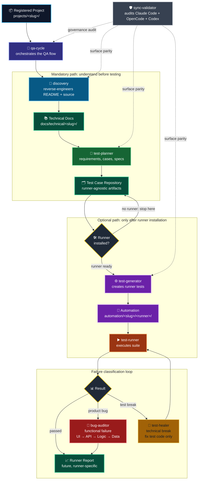

# workspaceQA

> Runner-agnostic QA workspace that structures the full quality cycle from discovery to test planning before choosing any automation framework.

[](https://nodejs.org/)
[](https://www.npmjs.com/)
[](#license)
[](#agent-cycle)
[](#multi-surface-sync)
[](#runner-agnostic-by-design)

workspaceQA is a QA engineering workspace for project discovery, reverse engineering, test case design, and future automation planning.

It is not a Playwright project. It is not a Cypress project. It is the structure that comes before those tools.

---

## Why This Exists

Most QA portfolios start with a tool: "I automated tests with Playwright on a demo app."

workspaceQA starts earlier: with understanding.

Before writing a single automated test, the workspace registers a target project, documents what is known, reverse-engineers the README and source code, maps modules, routes, entities, risks, business rules, and test data needs, then turns that discovery into traceable requirements, cases, and runner-agnostic specs.

Automation comes later, only after the project has a test architecture and a selected runner.

This mirrors how QA engineering works in real systems:

```text
source code -> discovery -> technical documentation -> test cases -> specs -> optional automation
```

---

## What It Does

- Registers target projects under `projects/<slug>/`.
- Stores project metadata in `projects/<slug>/project.json`.
- Creates a project README scaffold with required discovery sections.
- Keeps cloned or linked source code under `projects/<slug>/source/` or another declared source path.
- Produces technical discovery documentation under `docs/technical/<slug>/`.
- Produces requirements, cases, and specs under `test-case-repository/repository/<slug>/`.
- Keeps automation runner code out of the workspace core.
- Defines the same agent contracts across Claude Code, OpenCode, and Codex.

## What It Does Not Do By Default

The workspace core does not install or create:

- Playwright configuration.
- Cypress configuration.
- Browser binaries.
- Runner-specific fixtures.
- Runner-specific CI workflows.
- Generated automated tests.
- Test reports.

Runner-specific files belong only in a future project-specific automation area:

```text
automation/<slug>/<runner>/
```

---

## Architecture

```text
workspaceQA/
  projects/                  registered target projects and source code
  docs/
    technical/               discovery and reverse-engineering output
    standards/               documentation templates and standards
  test-case-repository/
    repository/              generated requirements, cases, and specs
    templates/               reusable requirement, case, and spec templates
  scripts/                   Node.js CLI tooling
  skills/                    reusable agent instructions
  .agents/                   canonical agent contracts and shared context
  .claude/agents/            Claude Code agent definitions
  .opencode/prompts/         OpenCode prompt definitions
  .codex/agents/             Codex TOML agent definitions
  AGENTS.md                  governance contract and source of truth
  CLAUDE.md                  Claude Code project context
  opencode.json              OpenCode configuration
  .mcp.json                  MCP configuration
  .codex/config.toml         Codex configuration
```

## Folder Responsibilities

| Folder | Responsibility |
| --- | --- |
| `projects/` | Stores registered project metadata, README files, and source paths. |
| `docs/technical/` | Stores generated discovery and reverse-engineering documentation. |
| `docs/standards/` | Stores documentation templates and standards. |
| `test-case-repository/repository/` | Stores requirements, cases, specs, and numbering for each registered project. |
| `test-case-repository/templates/` | Stores reusable requirement, case, spec, and numbering templates. |
| `automation/` | Reserved for future runner-specific automation after runner installation. |
| `scripts/` | Stores workspace CLI commands. |
| `skills/` | Stores reusable instructions used by agents. |
| `.agents/` | Stores canonical agent contracts, shared context, and anti-hallucination rules. |

`projects/` is intentionally clean. It must not contain test cases, specs, runner configs, or automation code.

---

## Quick Start

### 1. Install prerequisites

Use Node.js 18+ and npm 8+.

```bash
node --version
npm --version
```

### 2. Initialize the workspace

```bash
npm run init-workspace
```

This command:

- validates Node.js and npm versions;
- creates required workspace folders;
- optionally creates `.env.local` with `BASE_URL`;
- does not install Playwright, Cypress, browsers, or runner files.

### 3. Register a project

```bash
npm run register-project
```

The command asks for:

- project slug;
- display name;
- short description;
- base URL;
- Git repository URL or existing local source path;
- branch, when cloning a Git repository;
- project type.

It creates:

```text
projects/<slug>/
  project.json
  README.md
  source/        # when a Git repository is cloned
```

### 4. Validate the workspace

```bash
npm run check-workspace
```

This checks:

- Node.js and npm availability;
- required governance files;
- required agent folders;
- registered projects;
- project metadata and README files;
- declared source paths;
- optional `.env.local` values;
- runner status.

### 5. Run the agent cycle

After registration, run discovery first:

```text
@discovery <slug>
```

Then run test planning:

```text
@test-planner <slug>
```

Generation and execution are conditional:

```text
@test-generator <slug>  # only after a runner is installed
@test-runner <slug>     # only after generated tests and an installed runner exist
```

---

## Project Registration Contract

Before discovery, the target project must exist in:

```text
projects/<slug>/
```

Required files:

```text
projects/<slug>/project.json
projects/<slug>/README.md
```

Recommended source location:

```text
projects/<slug>/source/
```

`project.json` stores the project name, slug, description, project type, base URL, repository URL, branch, source path, API docs placeholder, and automation status.

The generated project README is a discovery scaffold. It asks for:

- product purpose;
- user roles and permissions;
- key user flows;
- routes and access requirements;
- key entities;
- tech stack;
- module dependency graph;
- test data requirements;
- known complexity.

Unknown sections must stay explicit as `To verify`.

---

## Agent Cycle

The quality cycle is driven by 8 specialized agents with explicit responsibilities.

The map below shows the real workspace flow: registration first, discovery as a mandatory gate, runner-agnostic planning, optional automation, and failure classification after execution.



### Phase Outputs

| Phase | Agent | Reads | Writes |
| --- | --- | --- | --- |
| Registration | CLI | User input, Git repo or local path | `projects/<slug>/project.json`, `projects/<slug>/README.md`, optional `projects/<slug>/source/` |
| Discovery | `discovery` | Project README, metadata, source code | `docs/technical/<slug>/` |
| Planning | `test-planner` | Technical documentation | `test-case-repository/repository/<slug>/requirements/`, `cases/`, `specs/` |
| Generation | `test-generator` | Specs and installed runner | `automation/<slug>/<runner>/` |
| Execution | `test-runner` | Generated tests and runner config | Runner-specific result/report |
| Functional audit | `bug-auditor` | Failing behavior and system layers | Failure analysis grounded in UI, API, logic, and data |
| Test healing | `test-healer` | Technical test break | Test-code fix without changing assertions to hide bugs |
| Sync audit | `sync-validator` | `.claude/agents/`, `.opencode/prompts/`, `.codex/agents/` | Cross-surface consistency findings |

| Agent | Responsibility | Cycle Position |
| --- | --- | --- |
| `qa-cycle` | Orchestrates discovery, planning, optional generation, and optional execution. | Entry point |
| `discovery` | Reads project README and source code, then writes technical documentation. | Phase 1, mandatory |
| `test-planner` | Converts technical documentation into requirements, cases, and specs. | Phase 2 |
| `test-generator` | Generates tests only for the installed runner selected by the project. | Phase 3, conditional |
| `test-runner` | Executes tests only when generated tests and a runner exist. | Phase 4, conditional |
| `bug-auditor` | Traces functional failures through UI, API, logic, and data layers. | Conditional |
| `test-healer` | Fixes technical test breaks only for the installed runner. | Conditional |
| `sync-validator` | Audits consistency between all executor surfaces. | Standalone |

Key rules:

- Never skip discovery.
- Stop if the target project is not registered.
- Keep cases and specs in `test-case-repository/`.
- Keep generated technical documentation in `docs/technical/`.
- Stop before test generation when no runner is installed.
- Never create runner files in the workspace core.
- Never fix a failing assertion to hide a real product bug.
- Never invent domain rules not grounded in README or source code.
- Never modify a registered project's source code without explicit user request.

---

## Multi-Surface Sync

The same operational contract is maintained across one canonical context and three executor surfaces:

| Executor | Directory | Format |
| --- | --- | --- |
| Canonical | `.agents/contracts/` | Markdown |
| Claude Code | `.claude/agents/` | Frontmatter YAML + Markdown adapter |
| OpenCode | `.opencode/prompts/` | Markdown adapter |
| Codex | `.codex/agents/` | TOML adapter with embedded instructions |

`AGENTS.md` is the durable governance file.
`.agents/` is the canonical source for agent behavior.
Executor-specific folders adapt that behavior to each tool.

When modifying an agent:

1. Update `.agents/contracts/<name>.md`.
2. Update `.claude/agents/<name>.md`.
3. Update `.opencode/prompts/<name>.md`.
4. Update `.codex/agents/<name>.toml`.
5. Update affected docs.
6. Run `npm run validate-agent-sync`.

When modifying tool configuration, update these files together:

```text
.mcp.json
opencode.json
.codex/config.toml
```

Divergence between surfaces is treated as a defect.

---

## Discovery-Driven Testing

Discovery runs before planning. Its job is to understand the target project before deciding what to test.

Inputs:

```text
projects/<slug>/project.json
projects/<slug>/README.md
projects/<slug>/source/
```

Expected technical output:

```text
docs/technical/<slug>/
  overview.md
  architecture.md
  source-map.md
  routes.md
  entities.md
  risks.md
  test-architecture-plan.md
  modules/
    <module>/
      README.md
      business-rules.md
      endpoints.md
      components.md
      test-data.md
      risks.md
```

Discovery output separates facts, inferences, and unknowns:

| Marker | Meaning |
| --- | --- |
| `[FACT]` | Directly stated in README or source code. |
| `[INFERRED]` | Derived from code patterns, naming, or structure. |
| `[TO VERIFY]` | Requires live-app validation or human confirmation. |

This prevents the test plan from inventing business rules.

---

## Traceability

Traceability flows through four layers:

```text
docs/technical/<slug>/modules/<module>/
  -> test-case-repository/repository/<slug>/requirements/
  -> test-case-repository/repository/<slug>/cases/
  -> test-case-repository/repository/<slug>/specs/
  -> automation/<slug>/<runner>/ [future, optional]
```

Test IDs follow this format:

```text
TC-<PROJECT>-<DOMAIN>-<NUMBER>
```

Rules:

- `PROJECT`: uppercase slug, max 6 characters.
- `DOMAIN`: uppercase domain name.
- `NUMBER`: three-digit sequence.

Example:

```text
TC-SHOP-CATALOG-001
```

The intended chain is:

```text
Requirement -> Test Case -> Spec -> Optional Automated Test -> Runner Report
```

---

## CLI Commands

| Command | Alias | Purpose |
| --- | --- | --- |
| `npm run init-workspace` | `npm run setup` | Validate Node/npm and create core folders. |
| `npm run register-project` | `npm run link-project` | Register a project, create metadata, and optionally clone a Git repo. |
| `npm run check-workspace` | `npm run check-env` | Validate workspace structure, agent folders, projects, source paths, and optional env values. |
| `npm run validate-agent-sync` | `npm run sync-validator` | Validate canonical agent context, executor adapters, runner boundaries, and TC ID coverage. |
| `npm run new-spec` | none | Create a runner-agnostic spec scaffold under `test-case-repository/repository/<slug>/specs/`. |
| `npm run report` | none | Explain that reporting is runner-specific until automation exists. |

### Create a spec scaffold manually

Use this only after a project is registered:

```bash
npm run new-spec
```

The command asks for:

- project slug;
- domain;
- module name;
- first test case ID;
- spec title.

It writes:

```text
test-case-repository/repository/<slug>/specs/<domain>/<module>.md
```

---

## Runner-Agnostic By Design

workspaceQA intentionally separates quality architecture from automation implementation.

The workspace can plan for Playwright, Cypress, or another runner later, but it does not ship those tools in the core. That avoids turning every project into the same test framework before discovery proves what the project needs.

Runner-specific automation belongs in:

```text
automation/<slug>/<runner>/
```

Runner installation is a future project-specific flow, not a workspace bootstrap step.

---

## Governance

`AGENTS.md` is the source of truth for workspace behavior.

Read it before changing:

- agent behavior;
- cycle order;
- folder boundaries;
- sync rules;
- tool configuration;
- runner rules.

Read `docs/writing-standards.md` before editing docs, agents, scripts, templates, or project scaffolds.

Important supporting docs:

- `docs/how-it-works.md`
- `docs/adding-a-project.md`
- `docs/agent-cycle.md`
- `docs/agent-consolidation-study.md`
- `docs/agent-best-practices.md`
- `docs/writing-standards.md`
- `test-case-repository/README.md`

---

## Tech Stack

| Category | Technology |
| --- | --- |
| Runtime | Node.js 18+, npm 8+ |
| CLI | JavaScript Node scripts |
| Agent surfaces | Claude Code, OpenCode, Codex |
| Agent formats | Markdown, frontmatter Markdown, TOML |
| Configuration | JSON, TOML |
| Protocol | MCP configuration via `.mcp.json` |
| Test design | Runner-agnostic requirements, cases, and specs |
| Optional automation | Runner-specific automation after installation |

---

## What This Demonstrates

workspaceQA demonstrates a QA engineering workflow that starts with product understanding instead of tool selection.

It shows:

- discovery-driven QA;
- technical reverse engineering;
- runner-agnostic test planning;
- traceable requirements, cases, and specs;
- AI agent design with explicit authority boundaries;
- cross-surface agent governance;
- separation between planning and automation;
- CLI tooling for repeatable workspace operations.

---

## License

MIT

---

## Author

**Gabrielly Bellos** - Quality Engineer & SDET

[LinkedIn](https://www.linkedin.com/in/gabrielly-oliveira-bellos/) | [GitHub](https://github.com/gaabybellos)
