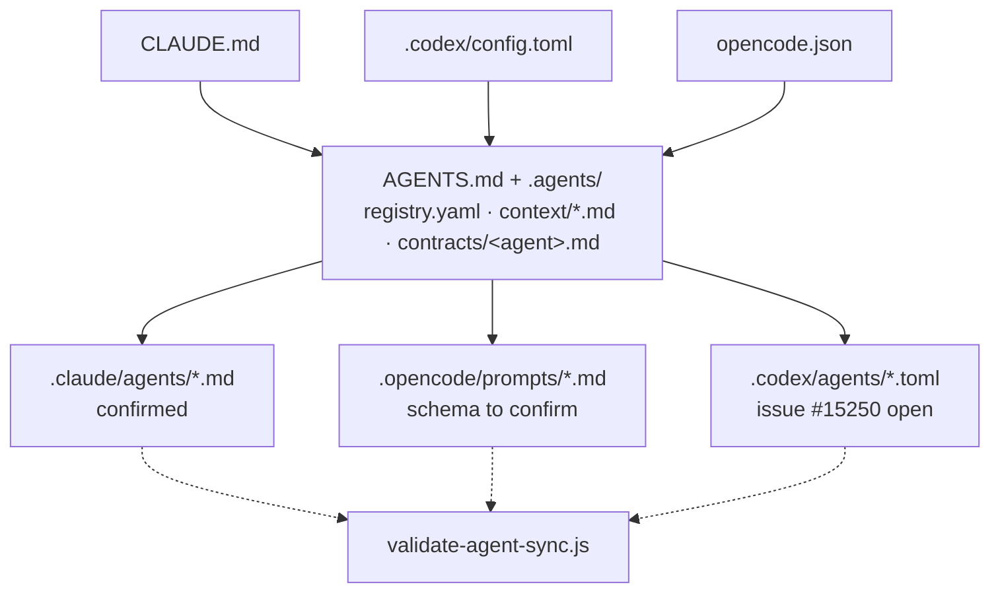
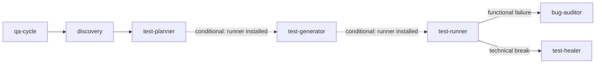

# Agent Contracts Study

Verifies workspaceQA's multi-executor agent architecture against the official documentation of each AI tool it targets, and against the open `AGENTS.md` standard.

This is a living document. Review it whenever `.claude/`, `.opencode/`, `.codex/`, or `.agents/` change — see the Documentation Sync table in `docs/writing-standards.md`.

Last verified: 2026-08-29.

## Verdict

The architecture is usable as designed. `AGENTS.md` as the governance root, `.agents/` as the canonical core (registry, context, contracts), and `.claude/` / `.opencode/` / `.codex/` as thin per-executor adapters is the correct shape for running Claude Code, OpenCode, and Codex against the same domain without each one inventing its own rules.

Two concrete gaps surfaced during verification, both external to the workspace's own design — see Findings.

## The Mechanism

Each AI tool has its own boot convention: Claude Code reads `CLAUDE.md`, Codex reads `AGENTS.md` natively, OpenCode reads `opencode.json`. No single file is the first read for all three. The workspace makes each entry point converge on the same canonical content within its first few reads, then keeps everything downstream of that point identical across tools.

`npm run validate-agent-sync` passed with no failures when run against this repository during verification: every agent has its canonical contract plus all three adapters, and each adapter references its contract's path. This confirms structure. It does not confirm that each tool actually loads the adapter in the format it is currently in — that is the open question behind the `warn` findings below.

## The QA Cycle

`test-generator` and `test-runner` are gated: they only run when the target project declares an installed runner. Without it, the cycle stops at `test-planner` by design.

`bug-auditor` and `test-healer` are never the same agent: one traces a product symptom, the other repairs a broken test. This split blocks the failure mode of silently editing an assertion until a test passes.

## Verified Against Sources

| Workspace practice | Confirmation | Source |
|---|---|---|
| `AGENTS.md` as a governance root read by multiple tools | **FACT** — open standard, adopted by Codex, Claude (via import), Copilot, Cursor, Zed, and others | [agents.md](https://agents.md/) |
| `CLAUDE.md` importing `AGENTS.md` via `@AGENTS.md` | **FACT** — this is the exact bridge the official docs recommend for repos that already maintain an `AGENTS.md` | [code.claude.com/docs/en/memory](https://code.claude.com/docs/en/memory) |
| Claude subagents at `.claude/agents/<name>.md`, YAML frontmatter with `name` and `description` | **FACT** — location and format match the current sub-agents doc | [code.claude.com/docs/en/sub-agents](https://code.claude.com/docs/en/sub-agents) |
| `skills/discovery/SKILL.md` and `skills/qa-env/SKILL.md` kept separate from role agents | **FACT** — a skill loads a procedure into the current conversation; a subagent runs with an isolated context. Complementary mechanisms, not interchangeable |  |
| `.codex/agents/<name>.toml` with `name`, `description`, `developer_instructions` | **FACT** — format matches community-documented Codex custom agent schema. **TO VERIFY** — an open issue on the official Codex repo reports these profiles are not always reachable from tool-backed sessions despite docs implying otherwise | [github.com/openai/codex issue #15250](https://github.com/openai/codex/issues/15250) |
| `.opencode/prompts/<name>.md` referenced from `opencode.json` | **TO VERIFY** — current OpenCode v2 docs point to `.opencode/agents/` as the project agent discovery path, and the JSON schema documented today differs from what this repo uses — see Findings | [opencode.ai/docs/agents](https://opencode.ai/docs/agents/) |

## Findings

| Status | Finding | Detail |
|---|---|---|
| ok | Single source + automated validation | `npm run validate-agent-sync` passed with no failures: all 8 agents have a canonical contract and 3 matching adapters, each citing the contract path. |
| ok | `CLAUDE.md → AGENTS.md` bridge | Matches the officially recommended pattern for multi-tool repositories exactly. No change needed. |
| ok | Claude subagent format | Location, frontmatter, and body match the current `.claude/agents/` documentation. |
| warn | `opencode.json` schema may be stale | Current docs describe the root key as `agent` (this repo uses `agents`), the prompt reference as a string `"{file:./path}"` (this repo uses an object `{"file": "..."}`), and `tools` as an object of booleans (this repo uses an array of names). Real risk: custom prompts in `.opencode/prompts/*.md` may not be loading in the installed OpenCode version. CLI schemas shift between versions — confirm by running a real agent invocation and checking whether the custom prompt reached the model. |
| warn | OpenCode discovery path unconfirmed | Already flagged as `[TO VERIFY]` in `docs/agent-consolidation-study.md`. This verification pass does not resolve it with certainty; it only reinforces that `.opencode/agents/` is what current v2 docs describe, not `.opencode/prompts/`. |
| warn | Open issue on `.codex/agents/` | TOML format is correct, but the official Codex repo has an open issue (#15250) reporting that custom subagents in `.codex/agents` are not always reachable from tool-backed sessions, contrary to what the docs imply. |
| warn (by design) | Full-content duplication between contract and adapters | 32 files (8 agents × 4 surfaces) repeat the same text. This is the deliberate cost of each tool only trusting what it reads natively at boot — a pointer-only adapter depends on the tool following that reference before acting, which none of the three guarantee today. The official Claude docs even recommend putting full instructions in the subagent body rather than a pointer. `validate-agent-sync.js` is what makes this duplication safe instead of risky. |

## Anti-Hallucination Principles

No tool guarantees that Claude, OpenCode, and Codex reach the same conclusion about a business rule. What prevents divergence is the workspace's design, not the tool. Five principles already encoded in `.agents/context/`:

1. **One source of truth, thin adapters.** `.agents/contracts/` is where a rule is born; everything in `.claude/`, `.opencode/`, and `.codex/` is derived from it. Without this, fixing a rule in one place and missing the other three is a matter of time.
2. **Evidence tagging.** `[FACT]` for what was read from a source, `[INFERRED]` for what was derived from code, `[TO VERIFY]` for what still needs confirmation. Turns silent guessing into something visible and auditable.
3. **Stop rules.** `anti-hallucination.md` requires stopping when `project.json` is missing, when discovery output is absent, or when failure classification is uncertain. An agent that stops on incomplete context is safer than one that fills the gap with assumption.
4. **ID-based traceability.** Every `TC-<PROJECT>-<DOMAIN>-<NUMBER>` chains requirement → case → spec → discovery doc → source code. Any agent or person can ask where a rule came from and get a traceable answer, or find the gap.
5. **Automated sync verification, not good faith.** Most multi-agent setups stop at principle 1 and trust nobody forgets to update an adapter. This workspace treats that as a testable invariant: `validate-agent-sync.js` fails the check when an adapter goes missing or loses its reference to the contract.

Tagging and stop rules guide agent behavior; they are not a technical block. A rule that must hold regardless of what an agent decides belongs in a hook or a validation script, not only in Markdown instructions.

## Recommendations

1. Test `opencode.json` against the installed OpenCode version. Run `opencode --version`, trigger an agent (e.g. `discovery`), and confirm the content of `.opencode/prompts/discovery.md` actually reached the model.
2. Test a real invocation of a `.codex/agents/*.toml` agent on an installed Codex CLI, given issue #15250.
3. Consider generating adapters from the canonical contract instead of hand-maintaining them. `docs/agent-consolidation-study.md` already proposes `scripts/generate-agent-adapters.js`; this would remove manual sync entirely and let `validate-agent-sync.js` become a regression test instead of a checklist.
4. Move `validate-agent-sync.js` into pre-commit or CI. Today it depends on being run manually; a hook turns it into the enforced stop rule that principle 5 describes, not just a documented one.

## Sources

- [agents.md](https://agents.md/) — open standard
- [code.claude.com/docs/en/memory](https://code.claude.com/docs/en/memory) — CLAUDE.md and memory
- [code.claude.com/docs/en/sub-agents](https://code.claude.com/docs/en/sub-agents) — Claude Code sub-agents
- [opencode.ai/v2/docs/agents](https://opencode.ai/v2/docs/agents/) — OpenCode v2 agents
- [opencode.ai/docs/agents](https://opencode.ai/docs/agents/) — OpenCode agents, current schema
- [github.com/openai/codex issue #15250](https://github.com/openai/codex/issues/15250) — `.codex/agents` reachability
- `npm run validate-agent-sync` — run directly against this repository during verification
